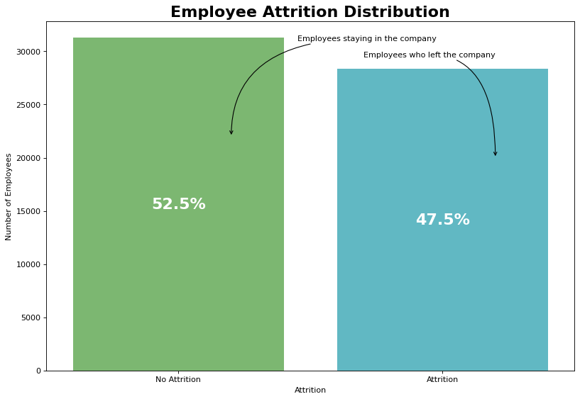
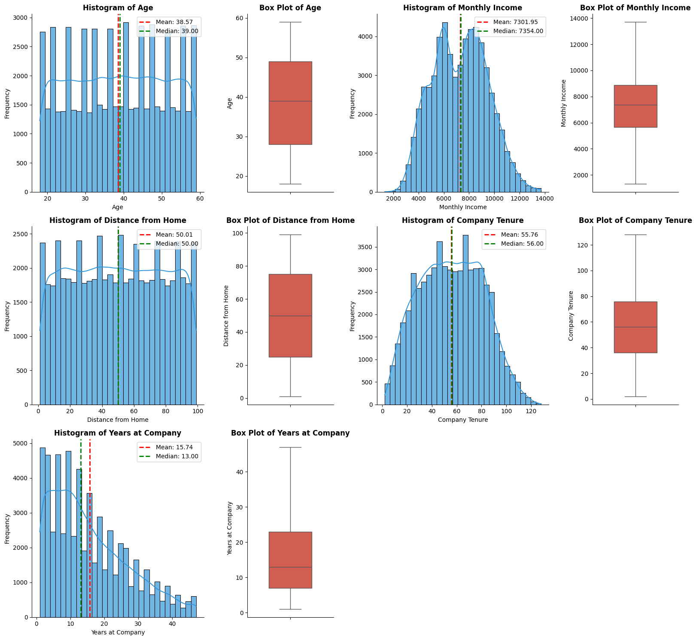
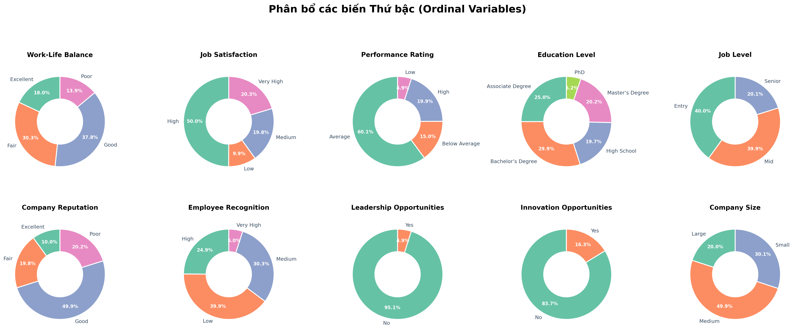
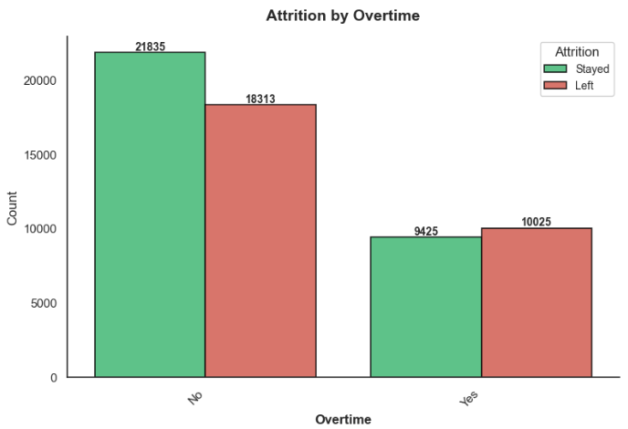
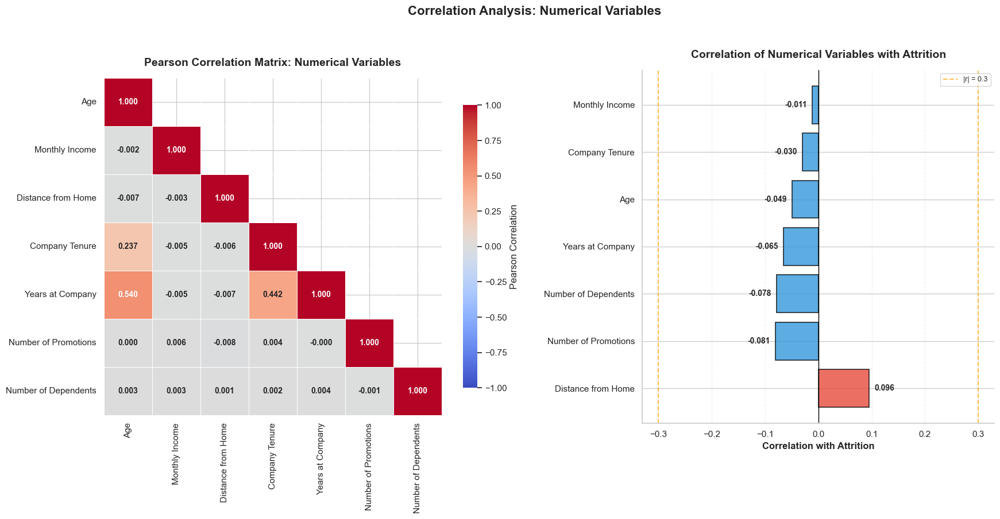
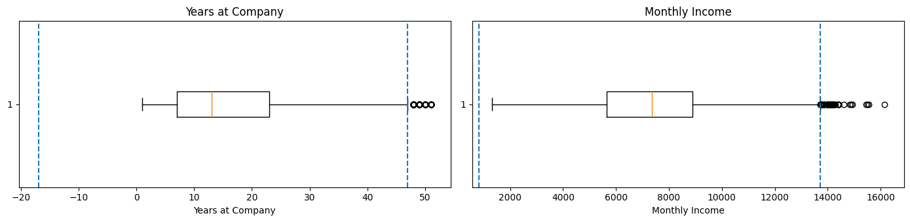
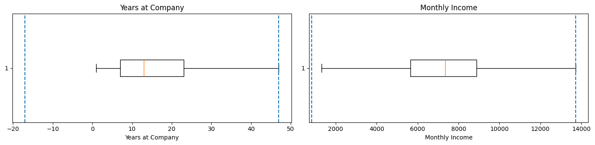
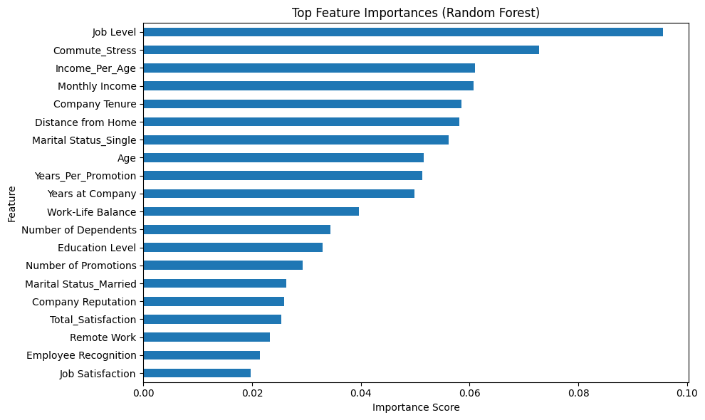

# HR Employee Attrition Analytics

An end-to-end Data Analytics project predicting employee turnover using machine learning. Built as part of the **NextGen Analytics Challenges 2025** competition.

## Table of Contents

- [Overview](#overview)
- [Pipeline](#end-to-end-pipeline)
- [Exploratory Data Analysis](#exploratory-data-analysis)
- [Preprocessing &amp; Feature Engineering](#preprocessing--feature-engineering)
- [Experiment Results](#experiment-results)
- [Conclusion](#conclusion)
- [Project Structure](#project-structure)

---

## Overview

**Objective:** Predict whether an employee will leave the company (attrition) based on various HR features, enabling proactive retention strategies.

**Dataset:**

- **Source:** NextGen Analytics Challenges 2025 - HR Theme
- **Size:** 59,598 records, 23 features
- **Features:** 7 numerical + 16 categorical
- **Target:** `Attrition` (Stayed: 52.5% / Left: 47.5%) - well-balanced

**Tech Stack:**

| Category            | Tools                                     |
| ------------------- | ----------------------------------------- |
| Language            | Python 3.x                                |
| Data Processing     | Pandas, NumPy                             |
| Visualization       | Matplotlib, Seaborn, Power BI             |
| Machine Learning    | Scikit-learn, XGBoost, LightGBM, CatBoost |
| Statistical Testing | SciPy (t-test, Chi-square)                |
| Environment         | Jupyter Notebook                          |

---

## End-to-End Pipeline

```
Data Collection --> EDA --> Preprocessing --> Feature Engineering --> Feature Selection --> Modeling --> Evaluation
     |               |          |                   |                     |                  |            |
   Raw CSV      Univariate   Cleaning          New features        3 Scenarios         11 Models    F2-Score
   59,598       Bivariate    Outliers           Interactions        (Full/FE/Stat)      2 Stages     (Primary)
   records      Multivariate Missing values     Encodings                               Screening
                Hypothesis                                                              + 5-Fold CV
```

| Step             | Description                                                         | Notebook                             |
| ---------------- | ------------------------------------------------------------------- | ------------------------------------ |
| 1. EDA           | Explore distributions, relationships, and patterns                  | `notebooks/01_EDA.ipynb`           |
| 2. Preprocessing | Clean data, handle outliers, encode features, engineer new features | `notebooks/02_Preprocessing.ipynb` |
| 3. Modeling      | Train 11 models across 3 scenarios, evaluate with F2-Score          | `notebooks/03_Modeling.ipynb`      |

---

## Exploratory Data Analysis

> Full analysis in [`notebooks/01_EDA.ipynb`](notebooks/01_EDA.ipynb)

### Target Distribution

The target variable `Attrition` is relatively balanced:

- **Stayed:** 52.5% (31,280 employees)
- **Left:** 47.5% (28,318 employees)

This balance means no special sampling techniques (SMOTE, undersampling) are required.

<!-- <chèn ảnh vào đây: reports/figures/target_distribution.png (Pie chart hoặc Count plot của Attrition)> -->
<p align="center">
  
</p>

### Univariate Analysis

**Numerical Features:**

- `Age`: Uniformly distributed (18-59), mean ~38.6
- `Monthly Income`: Approximately normal, range 1,316 - 13,713, mean ~7,302
- `Years at Company`: Right-skewed, 1-47 years, mean ~15.7
- `Distance from Home`: Uniformly distributed, 1-99 km

<p align="center">
  
</p>

**Categorical Features:**

- `Gender`: Nearly balanced (Male/Female)
- `Job Role`: 5 categories (Education, Media, Healthcare, Technology, Finance)
- `Overtime`: ~40% work overtime
- `Job Level`: Entry / Mid / Senior

<!-- <chèn ảnh vào đây: reports/figures/univariate_numerical.png (Histogram của Age/Monthly Income) và reports/figures/univariate_categorical.png (Bar chart của Job Role/Overtime)> -->

<p align="center">
  
</p>

### Bivariate Analysis

Key relationships identified between features and Attrition:

- Employees with **Overtime** show higher attrition rates
- Lower **Job Satisfaction** correlates with higher attrition
- **Work-Life Balance** significantly impacts attrition decisions
- **Company Reputation** and **Employee Recognition** are influential factors

<!-- <chèn ảnh vào đây: reports/figures/bivariate_overtime_attrition.png (Stacked bar chart hoặc Count plot Overtime vs Attrition)> -->

<p align="center">
  
</p>

### Multivariate Analysis

- Correlation analysis between numerical features
- Feature importance ranking using Random Forest

<!-- <chèn ảnh vào đây: reports/figures/correlation_matrix.png (Heatmap ma trận tương quan)> -->



### Power BI Dashboard

<!-- Power BI interactive dashboard will be added here -->

*Interactive Power BI dashboard coming soon - see [`reports/powerbi/`](reports/powerbi/)*

### Key Insights

1. The dataset is clean with no missing values, no duplicates, and no invalid values
2. Target variable is well-balanced (~52.5/47.5 split)
3. Outliers detected in `Years at Company` (273) and `Monthly Income` (50) - treated with capping
4. Both numerical and categorical features show meaningful variation across attrition groups
5. Organizational factors (Company Reputation, Employee Recognition) are as important as job-specific factors

---

## Preprocessing & Feature Engineering

> Full pipeline in [`notebooks/02_Preprocessing.ipynb`](notebooks/02_Preprocessing.ipynb)

### Data Cleaning

| Check            | Result                                                        |
| ---------------- | ------------------------------------------------------------- |
| Missing Values   | None detected (standard + extended NaN check)                 |
| Duplicate Rows   | 0 duplicates                                                  |
| Invalid Values   | All numerical ranges valid, all categorical values consistent |
| Constant Columns | None                                                          |

### Outlier Detection & Treatment

Using the **IQR Method**:

| Feature          | Outliers Detected | Treatment               |
| ---------------- | ----------------- | ----------------------- |
| Years at Company | 273               | Capping (Winsorization) |
| Monthly Income   | 50                | Capping (Winsorization) |
| Other features   | 0                 | No treatment needed     |

<!-- <chèn ảnh vào đây: reports/figures/outliers_boxplot.png (Boxplot của Years at Company và Monthly Income trước/sau khi cap)> -->
Before using IQR:



After using IQR:



### Feature Engineering

New features created through:

- Ordinal encoding for ordered categorical variables
- One-hot encoding for nominal variables
- Feature interactions and domain-specific transformations

### Feature Selection

To reduce dimensionality and remove highly correlated features, we used two main techniques:
- **Correlation Matrix**: Analyzed and removed numerical features with very high mutual correlation to prevent multicollinearity.
- **Feature Importance**: Trained a preliminary Random Forest model to rank features by their importance in predicting Attrition, filtering out the lowest contributing features.

<!-- <chèn ảnh vào đây: reports/figures/feature_importance.png (Biểu đồ Feature Importance từ Random Forest)> -->
<p align="center">
  
</p>

### Hypothesis Testing

Statistical tests to identify significant features:

- **T-test** for numerical features vs Attrition
- **Chi-square test** for categorical features vs Attrition

### Experimental Scenarios

Three feature selection strategies were designed to compare approaches:

| Scenario    | Name            | Features | Method                                     | Purpose                         |
| ----------- | --------------- | -------- | ------------------------------------------ | ------------------------------- |
| **1** | Baseline (Full) | 27       | All original features after encoding       | Baseline comparison             |
| **2** | FE + Selection  | 20       | Correlation + Feature Importance filtering | Evaluate FE effectiveness       |
| **3** | Statistical     | 11       | t-test + Chi-square top features           | Statistical approach comparison |

### Data Splitting

- **Train-Test Split:** 70:30 ratio (stratified)
- **K-Fold CV:** 5-fold stratified cross-validation

Output files organized in `data/scenarios/` with consistent `train_test/` and `kfold/` subdirectories.

---

## Experiment Results

> Full results in [`notebooks/03_Modeling.ipynb`](notebooks/03_Modeling.ipynb)

### Experimental Design

- **Total experiments:** 11 models x 3 scenarios x 2 evaluation stages = 66 experiments
- **Primary Metric:** F2-Score (prioritizes Recall over Precision - minimize False Negatives)
- **Rationale:** Missing an at-risk employee (FN) is more costly than unnecessary retention intervention (FP)

### Models Evaluated

| Group                             | Models                                                            |
| --------------------------------- | ----------------------------------------------------------------- |
| **Linear** (4)              | Logistic Regression, Ridge Classifier, SGD Classifier, Linear SVC |
| **Tree-based** (3)          | Decision Tree, Extra Trees, Gradient Boosting                     |
| **Ensemble & Boosting** (4) | Random Forest, XGBoost, LightGBM, CatBoost                        |

### Two-Stage Evaluation Strategy

| Stage                        | Method           | Purpose                                              |
| ---------------------------- | ---------------- | ---------------------------------------------------- |
| **Stage 1: Screening** | Train-Test Split | Screen all 11 models, select top finalists per group |
| **Stage 2: Final**     | 5-Fold CV        | Robust evaluation of finalists, select champion      |

### Results Summary (5-Fold CV - Stage 2)

**Scenario 1 - Baseline (Full Features, 27 features):**

| Rank | Model              | F2 (mean +/- std)           | Recall | Precision | Accuracy |
| ---- | ------------------ | --------------------------- | ------ | --------- | -------- |
| 1    | **LightGBM** | **0.7437 +/- 0.0042** | 0.7439 | 0.7427    | 0.7632   |
| 2    | CatBoost           | 0.7423 +/- 0.0037           | 0.7421 | 0.7430    | 0.7602   |
| 3    | Gradient Boosting  | 0.7397 +/- 0.0039           | 0.7379 | 0.7468    | 0.7648   |

**Scenario 2 - Feature Engineering + Selection (20 features):**

| Rank | Model              | F2 (mean +/- std)           | Recall | Precision | Accuracy |
| ---- | ------------------ | --------------------------- | ------ | --------- | -------- |
| 1    | **LightGBM** | **0.7389 +/- 0.0041** | 0.7398 | 0.7462    | 0.7574   |
| 2    | Gradient Boosting  | 0.7363 +/- 0.0041           | 0.7355 | 0.7486    | 0.7574   |
| 3    | CatBoost           | 0.7359 +/- 0.0031           | 0.7365 | 0.7453    | 0.7557   |

**Scenario 3 - Statistical Features (11 features):**

| Rank | Model                       | F2 (mean +/- std)           | Recall | Precision | Accuracy |
| ---- | --------------------------- | --------------------------- | ------ | --------- | -------- |
| 1    | **Gradient Boosting** | **0.7338 +/- 0.0041** | 0.7352 | 0.7373    | 0.7501   |
| 2    | LightGBM                    | 0.7333 +/- 0.0026           | 0.7348 | 0.7398    | 0.7530   |
| 3    | CatBoost                    | 0.7289 +/- 0.0031           | 0.7295 | 0.7335    | 0.7472   |

### Key Findings

1. **LightGBM** and **CatBoost** consistently perform as top models across all scenarios
2. **Scenario 1** (full features) produces the best overall results, suggesting the dataset benefits from more feature information
3. Performance degradation from Scenario 1 to Scenario 3 is moderate (~1%), indicating core predictive features are well-captured by statistical selection
4. All top models show **low variance** across folds (std < 0.005), indicating stable and reliable predictions
5. **Boosting methods** (LightGBM, CatBoost, Gradient Boosting, XGBoost) consistently outperform bagging and linear approaches

---

## Conclusion

- **Best Model:** LightGBM with full features (Scenario 1) achieves **F2 = 0.7437** with high stability
- **Trade-off:** Reducing features from 27 to 11 only drops F2 by ~1.4%, offering a simpler, more interpretable model
- **Business Impact:** The model can identify ~74% of at-risk employees, enabling targeted retention programs

### Future Work

- Deploy model as API for real-time predictions
- Incorporate temporal data for trend analysis

---

## Project Structure

```
hr_attrition_analytics/
|-- README.md
|-- LICENSE
|-- .gitignore
|-- data/
|   |-- raw/                           # Original dataset
|   |-- processed/                     # Cleaned & feature-engineered data
|   |-- scenarios/                     # 3 experimental scenarios
|       |-- scenario1/                 # Baseline (Full Features)
|       |-- scenario2/                 # FE + Selection
|       |-- scenario3/                 # Statistical Features
|-- notebooks/
|   |-- 01_EDA.ipynb                   # Exploratory Data Analysis
|   |-- 02_Preprocessing.ipynb         # Data Cleaning & Feature Engineering
|   |-- 03_Modeling.ipynb              # Model Training & Evaluation
|-- reports/
|   |-- figures/                       # EDA visualizations
|   |-- powerbi/                       # Power BI dashboard (coming soon)
|-- docs/                              # Problem statement & references
```

---

## License

This project is licensed under the MIT License - see the [LICENSE](LICENSE) file for details.
